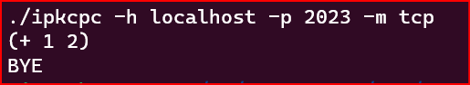
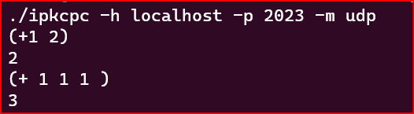
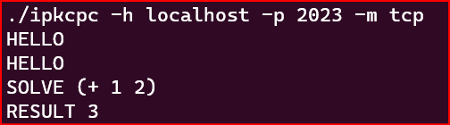

#Serverová kalkulačka pre UDP a TCP komunikáciu

##Úvod
Táto dokumentácia popisuje program v jazyku C, ktorý slúži ako serverová kalkulačka pre UDP a TCP komunikáciu. Server dokáže prijať matematický výraz a vyhodnotiť ho. Na základe argumentov, ktoré sú mu poskytnuté pri spustení, rozhodne o tom, či bude používať UDP alebo TCP protokol. Ak sa rozhodne pre použitie TCP, bude tiež využívať forking na spracovanie viacerých požiadaviek súčasne.

##Implementácia

Hlavná funkcia main
Hlavná funkcia programu sa nachádza v súbore "server.c" a slúži na spracovanie argumentov, vytvorenie a ovládanie socketov, riadenie toku programu a poskytovanie odpovedí klientom.

Po spustení programu sa načítajú argumenty príkazového riadku, ktoré určujú adresu hostiteľa, číslo portu a režim komunikácie. Funkcia check_args() skontroluje správnosť počtu a typu argumentov. Potom sa vytvorí socket podľa zvoleného režimu (TCP alebo UDP).

V prípade použitia UDP je nutné vytvoriť serverový socket pomocou funkcie socket() so špecifikáciou protokolu a typu socketu. Pri použití TCP je najprv potrebné vytvoriť socket pomocou rovnakej funkcie a následne inicializovať adresu, na ktorej sa bude počúvať, pomocou funkcie bind().

Ak bol zvolený režim TCP, program používa funkciu fork() na vytvorenie nového procesu pre každý prichádzajúci požiadavok. V tomto prípade je potrebné uzavrieť duplicitné súbory (napr. socket) v dieťaťovskom procese a ďalej spracovávať požiadavok v ňom.

####Funkcia calculate()
Funkcia calculate() slúži na vyhodnotenie matematického výrazu, ktorý dostane od klienta. Najprv sa overí platnosť výrazu a ak nie je v poriadku, funkcia zavolá funkciu send_err() na odoslanie chybovej správy. Výraz je následne spracovaný pomocou cyklu, ktorý postupne získava operandy a vykonáva príslušnú matematickú operáciu.

####Funkcia send_err()
Funkcia send_err() slúži na odoslanie chybovej správy klientovi a ukončenie príslušnej komunikácie. V prípade TCP komunikácie funk

####Funkcia "check_args"
Funkcia "check_args" slúži na overenie správnej syntaxe argumentov, ktoré sú zadávané pri spustení programu.

#####Parametre funkcie:

argc: celkový počet argumentov
argv: pole s argumentmi programu
Návratová hodnota:

bool hodnota, ktorá vyjadruje, či boli argumenty zadávané správne (true), alebo nie (false).
Funkcia najprv overí, či počet argumentov je správny (7). Ak áno, prechádza poľom argumentov a kontroluje, či boli zadané argumenty "-h", "-p" a "-m". Ak áno, zvýši počítadlo "cnt" o 1 pre každý správne zadaný argument. Po skončení kontroly, ak "cnt" nie je rovný 3 (tj. nie sú zadané všetky tri požadované argumenty), vypíše sa chybová hláška a program sa ukončí s chybovým kódom. Ak sú argumenty zadávané správne, funkcia vráti true.

Ak počet argumentov nie je rovný 7, vypíše sa chybová hláška a program sa ukončí s chybovým kódom.

####Funkcia create_socket
Funkcia create_socket slúži na vytvorenie socketu s daným typom protokolu a príznakmi pre komunikáciu. Funkcia má dva argumenty, prvý argument určuje typ protokolu, ktorým bude komunikácia prebiehať a druhý argument určuje príznaky, ktoré sa nastavia pre socket. Funkcia vracia vytvorený socket.

#####Argumenty funkcie
- `mode` - reťazec, ktorý určuje typ protokolu pre komunikáciu. Možnosti sú "tcp" alebo "udp".
- `flags` - celé číslo, ktoré určuje príznaky pre socket.

#####Správanie funkcie
Funkcia skontroluje typ protokolu a na základe toho vytvorí socket s príslušným typom. Ak sa vytvorenie socketu nepodarí, funkcia ukončí program s chybovým hlásením.

Pre protokol TCP sa použije funkcia socket so zadanými parametrami AF_INET, SOCK_STREAM a flags. Ak vytvorenie socketu zlyhá, funkcia skončí a vypíše chybové hlásenie.

Pre protokol UDP sa použije funkcia socket so zadanými parametrami AF_INET, SOCK_DGRAM a flags. Ak vytvorenie socketu zlyhá, funkcia skončí a vypíše chybové hlásenie.

Ak sa vytvorenie socketu úspešne podarí, funkcia nastaví socketovú možnosť SO_REUSEADDR na hodnotu 1, aby sa zabránilo problémom s prerušeným spojením.

####Funkcia binding
Funkcia binding slúži na naviazanie vytvoreného socketu na zadaný port a na priradenie socketu k serverovej adrese. Funkcia má tri argumenty, prvý argument určuje port, na ktorom bude socket naviazaný, druhý argument je vytvorený socket a tretí argument je štruktúra, ktorá obsahuje informácie o serverovej adrese.

Argumenty funkcie
- `port` -  celé číslo, ktoré určuje port, na ktorom bude socket naviazaný.
- `Socket` - celé číslo, ktoré reprezentuje vytvorený socket.
- `server_addr` - štruktúra, ktorá obsahuje informácie o serverovej adrese.

Funkcia začína vytvorením premennej server_port, do ktorej sa uloží číslo portu. Následne sa premazanie celého obsahu štruktúry server_addr, aby nebol v nej žiadny náhodný obsah.

Do štruktúry server_addr sa následne priradia hodnoty, ktoré sú potrebné pre naviazanie adresy a portu na soket:

- `sin_family` - typ adresy, v tomto prípade IPv4 (konkrétne hodnota AF_INET)
- `sin_addr.s_addr` - sieťová adresa, na ktorej má soket počúvať prichádzajúce spojenia (v tomto prípade sa použije adresa INADDR_ANY, ktorá značí, že soket počúva na všetkých dostupných sieťových rozhraniach)
- `sin_port` - číslo portu, na ktorom má soket počúvať prichádzajúce spojenia (hodnota tejto premennej sa nastaví na htons(port), aby sa zabezpečila správna konverzia z host-byte order na network-byte order)

Následne sa vytvorí smerník na štruktúru sockaddr, ktorým sa inicializuje premenná address, a do premennej address_size sa uloží veľkosť štruktúry server_addr. Týmto sa zabezpečí správne pretypovanie adresy štruktúry server_addr na adresu štruktúry sockaddr, ktorá sa používa pre funkciu bind().

Nakoniec sa pomocou funkcie bind() naviaže adresa a port na soket. Ak táto operácia skončí s chybou, funkcia vypíše chybovú správu pomocou funkcie perror() a program sa ukončí s chybovým kódom EXIT_FAILURE.

#####Návratová hodnota
Funkcia binding() nevracia žiadnu hodnotu. Adresa a port sú naviazané na soket, ale nie je potrebné získať žiadnu

####Funkcia "handle_client" 
Je funkcia, ktorá sa stará o obsluhu klientov v TCP alebo UDP režime. Na začiatku funkcie sa nastaví pomocná premenná "helb" na hodnotu false, čo znamená, že klient ešte nezavolal príkaz "HELLO". Následne sa inicializuje buffer, ktorý bude slúžiť na príjem dát od klienta.

Následuje cyklus while, ktorý beží neustále, pokiaľ klient neukončí spojenie. V každej iterácii cyklu sa buffer vynuluje pomocou funkcie "memset", aby sa zabránilo pretečeniu bufferu. Následne sa použije funkcia "recv", ktorá prijme dáta od klienta a uloží ich do bufferu. Ak sa nepodarí prijať dáta od klienta (recv vráti hodnotu menšiu alebo rovnú 0), spojenie sa ukončí a server pošle chybovú správu pomocou funkcie "send_err".

Ak sa podarilo prijať dáta od klienta, tak sa vypíše prijatá správa na stdout. Následne sa použije funkcia "strtok", ktorá rozdelí prijaté dáta na slová na základe medzier a znakov nového riadku. Následne sa kontroluje, či server pracuje v TCP režime. Ak áno, tak sa použije podmienka "if", ktorá kontroluje, či klient poslal príkaz "HELLO". Ak áno, tak server pošle klientovi uvítaciu správu. Ak klient poslal príkaz "SOLVE", tak sa zistí výraz, ktorý chce klient vyriešiť, pomocou funkcie "calculate". Výsledok sa uloží do premennej "result" a server pošle klientovi odpoveď s výsledkom. Ak klient poslal príkaz "BYE", tak sa ukončí spojenie a server pošle klientovi správu "BYE". Ak klient poslal neznámy príkaz, tak sa pošle klientovi chybová správa pomocou funkcie "send_err" a cyklus sa ukončí.

Celkovo funkcia "handle_client" slúži na spracovanie príkazov od klienta v TCP alebo UDP režime. Akýkoľvek príkaz od klienta, ktorý nie je rozpoznaný, spôsobí ukončenie spojenia a odoslanie chybovej správy. Funkcia "handle_client" teda predstavuje jadro serverovej kalkulačky pre TCP a UDP komunikáciu, ktorá dokáže spracovať a vyriešiť matematické výrazy.

##TESTY

Testovanie zlého vstupu

Test pre UDP či funguje sčitovanie

TEstovanie, že je potrebne najprv napísať HELLO

